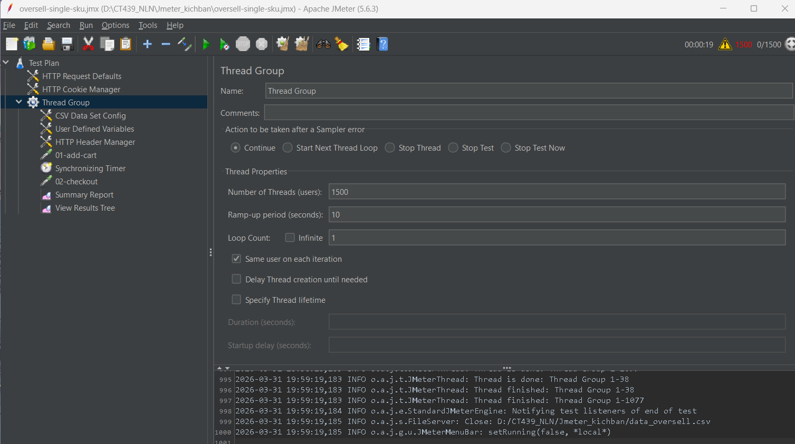
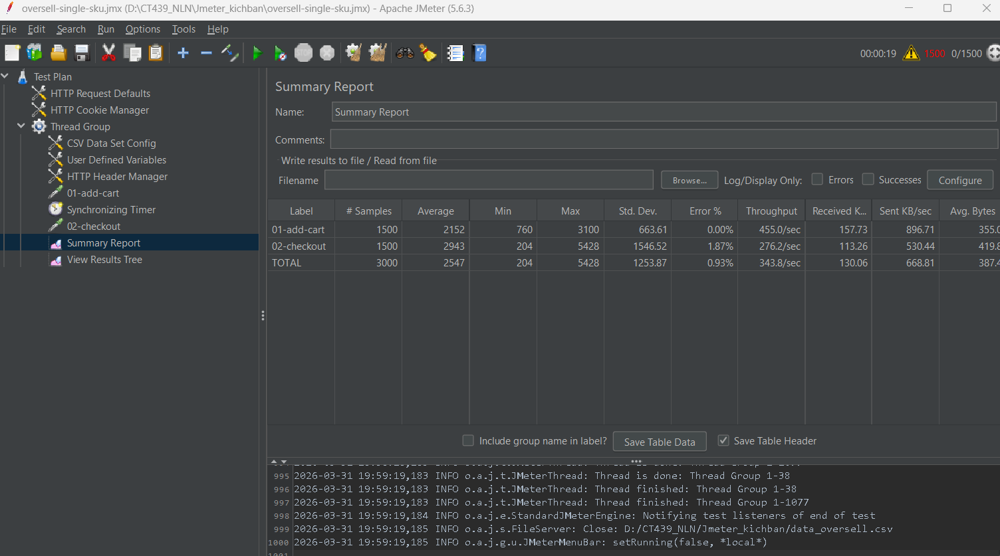
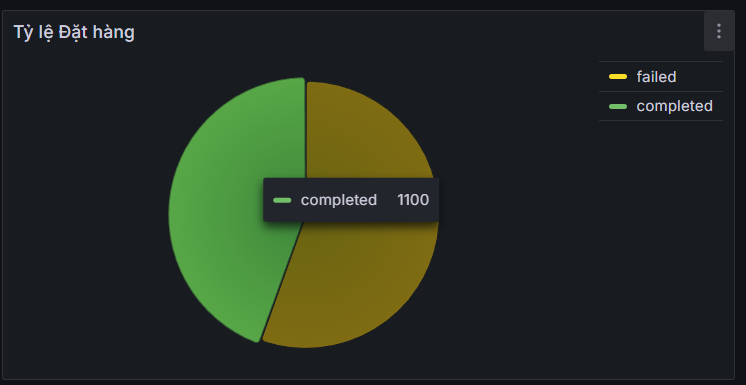
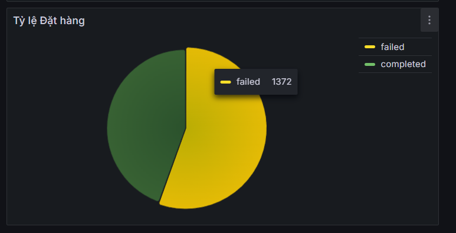
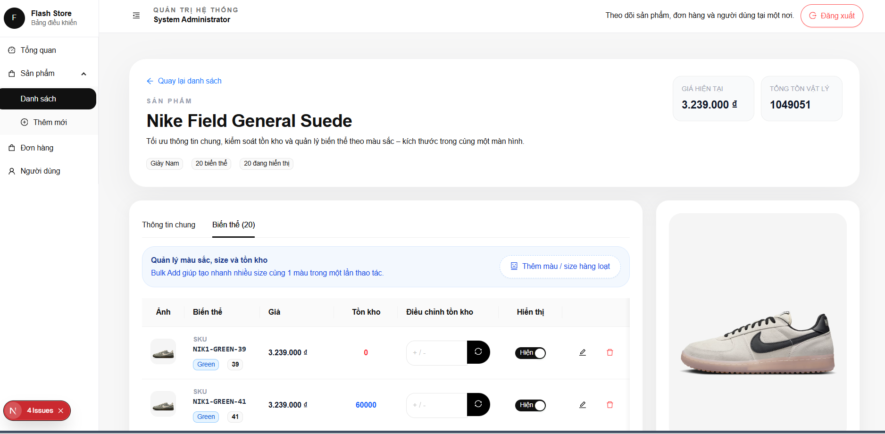
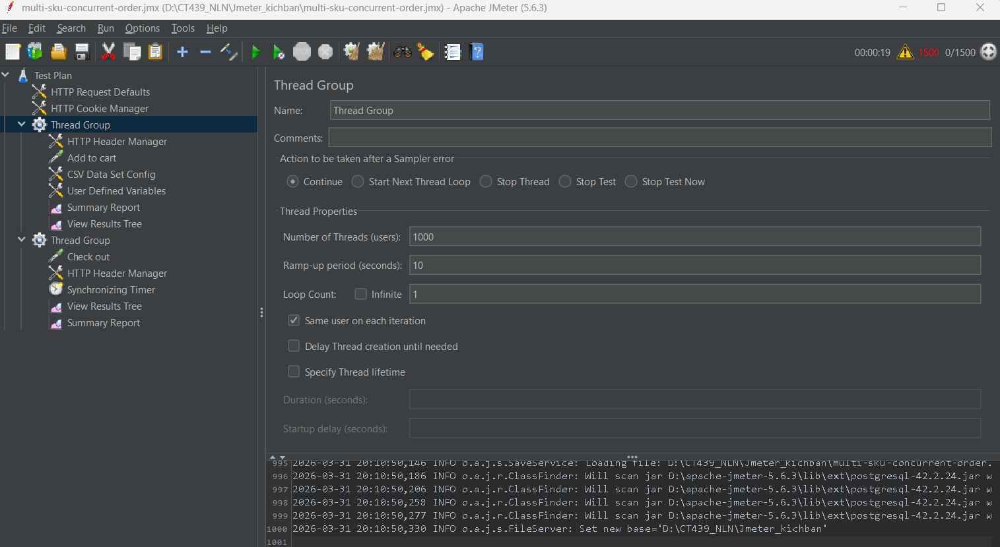
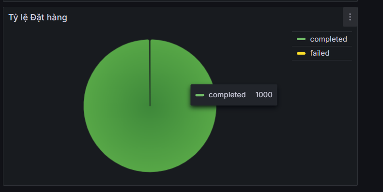

# Ecommerce Backend

Backend microservices cho bài test tải theo kịch bản **oversell**. Trọng tâm của project là kiểm tra khả năng xử lý khi nhiều người cùng đặt một SKU trong cùng thời điểm, thay vì phát triển một hệ thống ecommerce đầy đủ tính năng.

## Mục tiêu chính

- Mô phỏng luồng đặt hàng trong môi trường nhiều request đồng thời
- Kiểm tra nguy cơ oversell khi nhiều người tranh mua cùng một SKU
- Đánh giá cách hệ thống phối hợp giữa gateway, service business, cache, database và event bus
- Theo dõi trạng thái đơn hàng trong flow bất đồng bộ

## Kiến trúc chính

Project được tách thành nhiều service:

- `api-gateway`: điểm vào chung cho frontend
- `discovery-server`: service discovery
- `user-service`: đăng ký, đăng nhập, thông tin người dùng
- `product-service`: quản lý sản phẩm
- `inventory-service`: quản lý tồn kho
- `cart-service`: giỏ hàng
- `order-service`: tạo đơn và điều phối luồng đặt hàng
- `payment-service`: xử lý payment mock
- `notification-service`: đẩy trạng thái đơn hàng realtime

## Hạ tầng local

Repo có sẵn `docker-compose.yml` để chạy các thành phần chính:

- MySQL
- Redis
- Kafka
- Schema Registry
- Keycloak
- Prometheus
- Grafana
- Zipkin
- Nginx

## Công nghệ sử dụng

- Java – ngôn ngữ chính của backend
- Spring Boot – xây dựng API và các microservice
- Spring Cloud Gateway – gateway cho hệ thống
- Eureka – service discovery giữa các service
- MySQL – cơ sở dữ liệu chính
- Redis – cache và tăng tốc truy xuất
- Kafka – xử lý giao tiếp bất đồng bộ
- Keycloak – xác thực và phân quyền
- Prometheus / Grafana / Zipkin – giám sát hệ thống và theo dõi request
- Nginx – reverse proxy và điều hướng truy cập

## Bài toán mà repo này tập trung

Khi nhiều request đặt hàng đến cùng lúc cho một SKU:

- hệ thống có chặn được bán vượt tồn kho hay không
- trạng thái đơn hàng có còn nhất quán hay không
- service nào trở thành nút thắt khi tải tăng cao
- backend phản ứng thế nào khi flow phải đi qua nhiều service và nhiều bước bất đồng bộ

## Yêu cầu môi trường

- JDK 24
- Maven 3.9+
- Docker và Docker Compose

## Cấu hình mặc định

Project đã được khai báo sẵn cấu hình chạy local trong file `application.properties`, vì vậy sau khi tải source code về, bạn có thể chạy project ngay mà không cần tạo thêm file `.env` hoặc khai báo thêm biến môi trường cho Spring Boot.

Tuy nhiên, để ứng dụng khởi động thành công, các dịch vụ phụ trợ như database, Redis, Kafka, Keycloak và các service liên quan phải đang chạy đúng với địa chỉ và cổng đã được cấu hình sẵn trong project.

Nếu muốn thay đổi môi trường chạy, bạn có thể chỉnh trực tiếp các giá trị trong:

- `src/main/resources/application.properties`
- `docker-compose.yml` (nếu có sử dụng Docker Compose)

> Lưu ý: file `.env.example` chỉ mang tính minh họa cho các thông số cấu hình thường dùng. Trong project này, Spring Boot sử dụng các giá trị đã được khai báo sẵn trong `application.properties`. Khi chạy local, có thể dùng trực tiếp các giá trị mặc định đó. Nếu muốn thay đổi môi trường chạy, hãy cập nhật các thông số tương ứng trong file cấu hình của ứng dụng.

### Các biến chính

- `MYSQL_HOST`, `MYSQL_PORT`, `MYSQL_USER`, `MYSQL_PASSWORD`, `MYSQL_DATABASE`: cấu hình MySQL
- `REDIS_HOST`, `REDIS_PORT`: cấu hình Redis
- `KAFKA_BOOTSTRAP_SERVERS`: địa chỉ Kafka broker
- `SCHEMA_REGISTRY_URL`: địa chỉ Schema Registry
- `EUREKA_SERVER_URL`: địa chỉ Eureka
- `KEYCLOAK_SERVER_URL`, `KEYCLOAK_REALM`, `KEYCLOAK_CLIENT_ID`: cấu hình xác thực Keycloak
- `ZIPKIN_BASE_URL`: địa chỉ Zipkin
- `NGINX_PORT`: cổng Nginx local

### Biến môi trường liên quan đến VNPAY

Nếu muốn chạy luồng thanh toán VNPAY ở môi trường local, cần cấu hình thêm:

- `VNPAY_TMN_CODE`
- `VNPAY_HASH_SECRET`
- `VNPAY_PAY_URL`
- `VNPAY_RETURN_URL`

Nếu không kiểm thử luồng thanh toán, có thể bỏ qua phần cấu hình này.

## Cách chạy local

## Dữ liệu và thành phần đã có sẵn trong repo

Repo local này đã chuẩn bị sẵn một phần dữ liệu/hạ tầng để demo:

- `docker-compose.yml`: dựng MySQL, Redis, Kafka, Schema Registry, Keycloak, Prometheus, Grafana, Zipkin
- `mysql-init/init.sql`: khởi tạo database business ban đầu
- `keycloak-data/realm-export.json`: import realm cho Keycloak
- `product-service`: có logic seed dữ liệu phục vụ demo inventory / benchmark

Điều này giúp người clone có thể tái hiện môi trường local dễ hơn, nhưng vẫn nên đọc kỹ phần cấu hình trước khi chạy.

### 1. Clone project

```bash
git clone https://github.com/truongnguyen3006/ecommerce-backend-1-.git
cd <project-folder>
```

### 2. Chạy hạ tầng

Tại thư mục gốc backend:

```bash
docker compose up -d
```

### 3. Chạy các service Spring Boot

Có thể chạy bằng IDE hoặc Maven. Thứ tự nên chạy:

1. `discovery-server`
2. `api-gateway`
3. `user-service`
4. `product-service`
5. `inventory-service`
6. `order-service`
7. `payment-service`
8. `cart-service`
9. `notification-service`

Ví dụ:

```bash
cd order-service
mvn spring-boot:run
```

## Kiểm thử tải với JMeter

Repo cung cấp 2 kịch bản trong thư mục [Jmeter Script](./Jmeter%20Script/) để kiểm thử luồng đặt hàng đồng thời:

- `oversell-single-sku.jmx`: nhiều request cùng đặt mua một SKU để kiểm tra khả năng chặn oversell
- `multi-sku-concurrent-order.jmx`: nhiều request đồng thời đặt mua nhiều SKU khác nhau để kiểm tra tải phân tán trên nhiều biến thể sản phẩm

Các file dữ liệu đi kèm:

- `data_oversell.csv`: chứa một `skuCode` dùng chung cho toàn bộ request
- `data_multi.csv`: chứa danh sách nhiều `skuCode` để phân tán tải trên nhiều sản phẩm

### Chuẩn bị trước khi chạy

Trước khi chạy kịch bản, cần bảo đảm:

- backend API đang chạy và truy cập được
- các service liên quan đến luồng đặt hàng đã sẵn sàng
- dữ liệu test hợp lệ, gồm user, SKU, tồn kho và trạng thái dịch vụ
- đã có access token hợp lệ cho các request cần xác thực

### Cấu hình kịch bản trong JMeter

Mở một trong hai file `.jmx` bằng JMeter, sau đó kiểm tra và cập nhật lại các thành phần sau:

#### 1. Cấu hình địa chỉ API

Trong các `HTTP Request`, cập nhật lại:

- `Server Name or IP`
- `Port Number`

Theo địa chỉ backend đang sử dụng.

Nên dùng thống nhất một địa chỉ trong toàn bộ file test để tránh sai lệch kết quả khi benchmark.

#### 2. Cấu hình file dữ liệu CSV

Trong `CSV Data Set Config`, trỏ đúng tới file dữ liệu tương ứng trong thư mục `Jmeter Script`:

- `data_oversell.csv`
- `data_multi.csv`

Nếu JMeter đang giữ đường dẫn tuyệt đối cũ, cần sửa lại cho đúng vị trí hiện tại của file.

#### 3. Cập nhật access token

Trong `HTTP Header Manager`, thay giá trị:

```text
Authorization: Bearer <access_token>
```

bằng token mới.

Lưu ý: token có thời hạn. Khi hết hạn, cần đăng nhập lại để lấy token mới rồi cập nhật lại trong JMeter.

#### 4. Kiểm tra biến và tham số trong kịch bản

Trước khi chạy, nên kiểm tra lại các biến được sử dụng trong request, đặc biệt là:

- `skuCode` lấy từ file CSV
- các giá trị trong request body
- header xác thực
- các biến dùng để phân biệt từng lần chạy nếu kịch bản có dùng tiền tố như `RUN_PREFIX`

Nếu thay đổi số lượng request đồng thời, cần kiểm tra thêm các thành phần đồng bộ như `Synchronizing Timer` để giá trị khớp với số thread thực tế.

### Cách lấy access token

Hệ thống sử dụng JWT access token cho các request cần xác thực trong JMeter.

#### Tài khoản dùng để test

**1. Keycloak Admin Console**
- Username: `admin`
- Password: `admin`

> Đây là tài khoản dùng để đăng nhập vào **Keycloak Admin Console**, không phải tài khoản người dùng thông thường của ứng dụng.

**2. Tài khoản admin của ứng dụng**
- Username: `admin`
- Password: `admin123`

> Đây là tài khoản admin phía ứng dụng, có thể dùng để đăng nhập qua API, frontend hoặc Postman.

**3. Tài khoản người dùng thông thường**
- Realm import của Keycloak có thể đã bao gồm sẵn một số tài khoản test.
- Có thể tự đăng ký thêm tài khoản mới qua frontend hoặc API nếu cần.

#### Cách 1: Lấy token bằng `curl`

```bash
curl -X POST http://localhost:8000/auth/login \
  -H "Content-Type: application/json" \
  -d '{
    "username": "admin",
    "password": "admin123"
  }'
```

#### Cách 2: Lấy token bằng Postman

Tạo request:

```http
POST http://localhost:8000/auth/login
Content-Type: application/json
```

Body:

```json
{
  "username": "admin",
  "password": "admin123"
}
```

Sau khi đăng nhập thành công, copy giá trị `access_token` từ response và thay vào `HTTP Header Manager` trong file `.jmx`.
Nếu token hết hạn có thể login lại để lấy.

### Lưu ý khi benchmark

Để kết quả ổn định hơn, nên gửi request trực tiếp tới địa chỉ chạy backend thay vì đi qua lớp trung gian không cần thiết.

Nếu hệ thống chạy trong WSL2, có thể lấy IP bằng lệnh:

```bash
wsl ip -4 addr show eth0
```

Tránh trộn nhiều kiểu địa chỉ khác nhau trong cùng một file test, ví dụ vừa dùng `localhost` vừa dùng IP khác, vì dễ gây sai lệch khi đo tải.

### Gợi ý kiểm tra nhanh trước khi bấm chạy

Nên rà lại các điểm sau:

- backend trả response bình thường với request đặt hàng
- SKU trong file CSV tồn tại thật trong hệ thống
- tồn kho đủ hoặc đúng theo mục tiêu kiểm thử
- token còn hiệu lực
- toàn bộ `HTTP Request` đang trỏ đúng host và port
- `CSV Data Set Config` đang đọc đúng file dữ liệu

## Kết quả kiểm thử tải sau khi mở rộng lên 2 instance API Gateway
### Kịch bản 1: Oversell trên một SKU: test trên sku NIK1-WHITE-38, số lượng ban đầu là 100

#### JMeter Test Plan


#### JMeter Summary Report


#### Grafana dashboard Oversell success result: 100 yêu cầu thành công cộng với 1000 yêu cầu thành công từ test 2


#### Grafana dashboard Oversell fail result


#### Kết quả tồn kho sau test


### Kịch bản 2: Tải đồng thời trên nhiều SKU

#### JMeter Test Plan


#### JMeter Summary Report


#### Grafana dashboard Oversell


## Cổng mặc định

- Gateway: `8080`
- Eureka: `8761`
- Inventory: `8082`
- Product: `8083`
- Cart: `8084`
- Keycloak: `8085`
- Order: `8086`
- Notification: `8087`
- User: `8088`
- Payment: `8089`
- Nginx: `8000`

## Hạn chế hiện tại

- Mục tiêu chính là kiểm thử tải và oversell, không phải hoàn thiện toàn bộ nghiệp vụ ecommerce
- Payment hiện là luồng mô phỏng/tích hợp VNPay nếu không test benchmark
- Dự án phù hợp cho chạy local và benchmark hơn là triển khai production ngay

## Tác giả

- **Tên:** Nguyễn Lâm Trường
- **Email:** lamtruongnguyen2004@gmail.com
- **GitHub:** [https://github.com/truongnguyen3006](https://github.com/truongnguyen3006)
