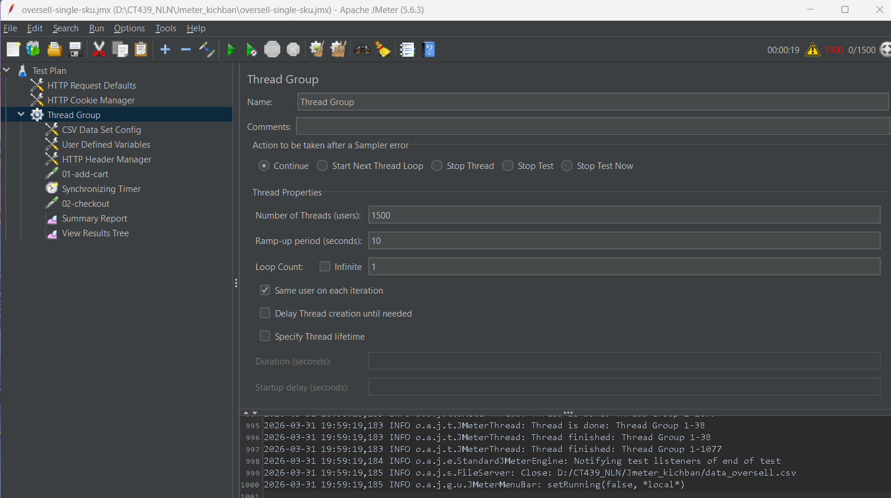
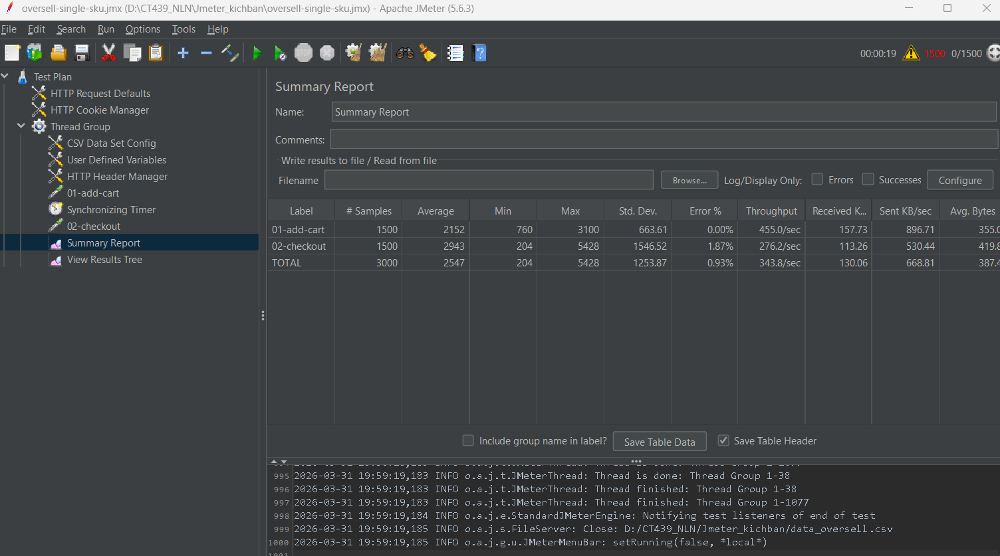
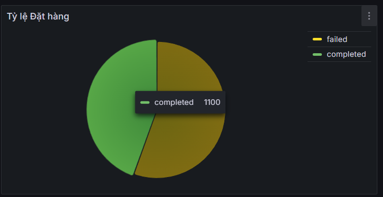
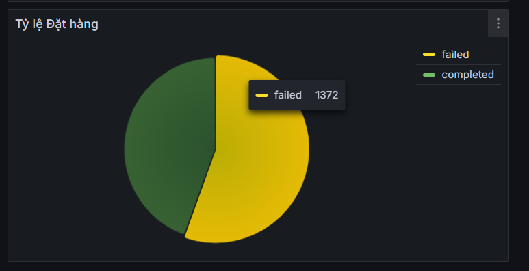
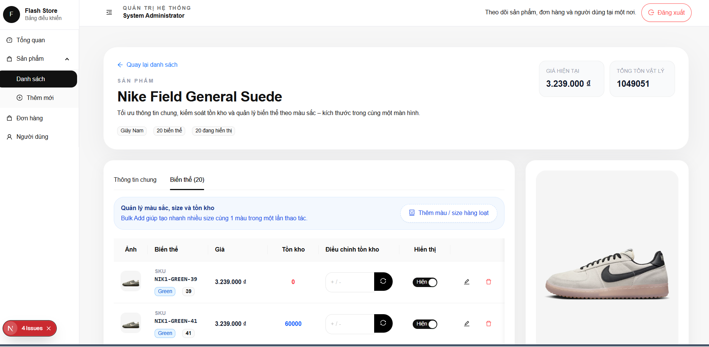
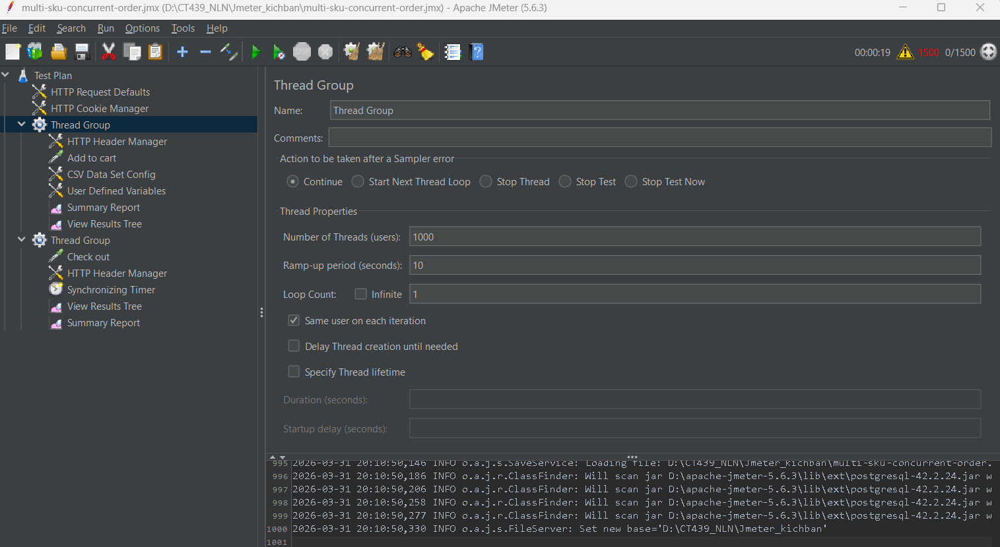
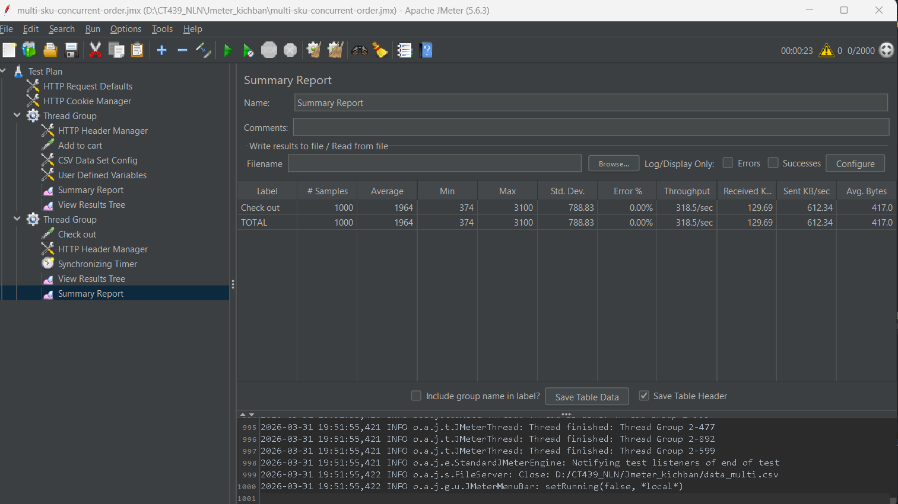
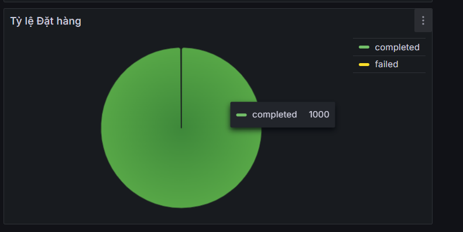

# High-Concurrency Ecommerce Microservices Backend

Backend microservices được xây dựng để kiểm thử **concurrent checkout**, **inventory consistency** và nguy cơ **overselling** khi nhiều người dùng cùng đặt hàng trong một khoảng thời gian ngắn.

Trọng tâm của project không phải là hoàn thiện toàn bộ nghiệp vụ ecommerce cho production, mà là xây dựng một hệ thống đủ thực tế để thử nghiệm cách các microservice, cache, database, Kafka và API Gateway phối hợp dưới tải đồng thời.

## Kết quả nổi bật

| Kịch bản | Tải kiểm thử | Mục tiêu | Kết quả chính |
|---|---:|---|---|
| Single-SKU oversell | 1,500 virtual users | Nhiều request cùng tranh mua SKU `NIK1-GREEN-39`, tồn kho ban đầu 100 | 100 đơn hoàn tất, tồn kho cuối = 0; các đơn còn lại bị từ chối khi hết tồn kho |
| Multi-SKU concurrent checkout | 1,000 checkout requests | Phân tán tải trên nhiều SKU | 0% JMeter error, throughput khoảng 318.5 req/s trong lần benchmark được lưu |

> Các số liệu trên được lấy từ các screenshot benchmark đã lưu trong repo. File `.jmx` là test plan có thể cấu hình lại số thread; khi thay đổi thread count cần cập nhật `Synchronizing Timer` tương ứng.

## Mục tiêu chính

- Mô phỏng luồng đặt hàng trong môi trường có nhiều request đồng thời.
- Kiểm tra khả năng ngăn oversell khi nhiều người cùng tranh mua một SKU có tồn kho giới hạn.
- Giữ trạng thái tồn kho nhất quán trong flow bất đồng bộ.
- Đánh giá cách gateway, business services, Redis, MySQL và Kafka phối hợp dưới tải cao.
- Theo dõi trạng thái đơn hàng và hành vi của hệ thống qua Prometheus, Grafana và Zipkin.

## Kiến trúc chính

Project được tách thành các service sau:

- `api-gateway`: điểm vào chung của hệ thống.
- `discovery-server`: service discovery bằng Eureka.
- `user-service`: đăng ký, đăng nhập và thông tin người dùng.
- `product-service`: quản lý sản phẩm, cache và upload ảnh sản phẩm.
- `inventory-service`: quản lý tồn kho và xử lý kiểm tra tồn kho bằng Kafka Streams.
- `cart-service`: quản lý giỏ hàng.
- `order-service`: tạo đơn và điều phối luồng đặt hàng.
- `payment-service`: xử lý payment workflow, hỗ trợ tích hợp VNPay Sandbox; benchmark có thể sử dụng luồng thanh toán mô phỏng/đơn giản hóa.
- `notification-service`: cập nhật trạng thái đơn hàng theo flow bất đồng bộ.

Trong benchmark mở rộng, Nginx phân phối request theo `least_conn` tới **2 API Gateway instances** chạy tại `8080` và `8090`, với Nginx expose ra cổng `8000`.

## Một số quyết định kỹ thuật chính

- Kafka Streams xử lý inventory theo key `skuCode` để các event của cùng một SKU được xử lý theo cùng key.
- Inventory sử dụng persistent state store để duy trì trạng thái tồn kho phục vụ xử lý stream.
- Kafka Streams được cấu hình `exactly_once_v2` cho topology inventory.
- Redis được sử dụng cho cart data, cache và một số workflow state.
- Nginx sử dụng `least_conn` để cân bằng tải giữa hai API Gateway instances trong bài benchmark.
- JMeter sử dụng `Synchronizing Timer` để tạo contention khi nhiều virtual users checkout gần như cùng lúc.

## Hạ tầng local

Repo có `docker-compose.yml` để dựng các thành phần hạ tầng chính:

- MySQL
- Redis
- Kafka
- Schema Registry
- Keycloak
- Prometheus
- Grafana
- Zipkin
- Nginx

## Công nghệ sử dụng

- **Java** – ngôn ngữ chính của backend.
- **Spring Boot** – xây dựng REST API và các microservice.
- **Spring Cloud Gateway** – API Gateway.
- **Eureka** – service discovery.
- **MySQL** – cơ sở dữ liệu quan hệ cho các business service.
- **Redis** – cart data, cache và hỗ trợ xử lý state.
- **Kafka** – giao tiếp bất đồng bộ giữa các service.
- **Kafka Streams** – xử lý inventory stream, keyed processing và state store.
- **Keycloak / OAuth2 / JWT** – xác thực và phân quyền.
- **Docker Compose** – dựng hạ tầng local.
- **Nginx** – reverse proxy và load balancing cho API Gateway.
- **Prometheus / Grafana / Zipkin** – metrics, monitoring và distributed tracing.
- **JMeter** – kiểm thử tải và concurrent checkout.
- **VNPay Sandbox** – tích hợp luồng thanh toán.
- **Cloudinary** – upload ảnh sản phẩm phía server.

## Bài toán mà repo tập trung

Khi nhiều request đặt hàng đến cùng lúc, project tập trung kiểm tra các câu hỏi sau:

- Hệ thống có chặn được bán vượt tồn kho hay không?
- Tồn kho có giữ được trạng thái hợp lệ khi nhiều request cùng tranh mua một SKU hay không?
- Luồng order → inventory → payment/notification phản ứng thế nào khi tải tăng cao?
- Gateway và các business service hoạt động ra sao khi phải xử lý nhiều request gần như đồng thời?
- Metrics và tracing có cung cấp đủ thông tin để quan sát hệ thống trong quá trình benchmark hay không?

## Yêu cầu môi trường

- JDK 24
- Maven 3.9+
- Docker và Docker Compose
- Apache JMeter nếu muốn chạy lại load test

## Cấu hình

Phần lớn các service hiện có cấu hình local mặc định trực tiếp trong `application.properties`. Vì vậy khi chạy trên máy local, cần bảo đảm MySQL, Redis, Kafka, Keycloak, Eureka và các service liên quan đang chạy đúng host/port mà project đang cấu hình.

File `.env.example` trong repo chủ yếu đóng vai trò tham khảo. Không phải mọi service hiện tại đều tự động đọc toàn bộ biến trong file này.

Nếu thay đổi môi trường chạy, hãy kiểm tra các file:

- `*/src/main/resources/application.properties`
- `docker-compose.yml`
- `nginx.conf`

### VNPay Sandbox

`payment-service` hỗ trợ các biến môi trường sau:

- `VNPAY_TMN_CODE`
- `VNPAY_SECRET_KEY`
- `VNPAY_RETURN_URL`
- `VNPAY_IPN_URL`
- `FRONTEND_BASE_URL`
- `ORDER_SERVICE_BASE_URL`

Nếu chỉ chạy benchmark mà không kiểm thử VNPay, có thể sử dụng flow benchmark mà không cần hoàn thiện thanh toán thực tế.

> **Security note:** không commit credential thật của VNPay, Cloudinary hoặc các external service lên public repository. Khi public/deploy project, nên truyền secret qua environment variables hoặc secret manager và rotate các credential đã từng bị lộ trong Git history.

## Dữ liệu và thành phần có sẵn

Repo đã chuẩn bị một số thành phần để tái hiện môi trường local:

- `docker-compose.yml`: dựng các dependency chính.
- `mysql-init/init.sql`: khởi tạo database business ban đầu.
- `keycloak-data/realm-export.json`: import realm cho Keycloak.
- `product-service`: có logic seed dữ liệu phục vụ demo inventory và benchmark.
- `Jmeter Script/`: chứa test plan và dữ liệu cho hai kịch bản load test.

## Cách chạy local

### 1. Clone project

```bash
git clone https://github.com/truongnguyen3006/ecommerce-backend-1-.git
cd ecommerce-backend-1-
```

### 2. Chạy hạ tầng

Tại thư mục gốc backend:

```bash
docker compose up -d
```

### 3. Chạy các Spring Boot service

Có thể chạy bằng IDE hoặc Maven. Thứ tự gợi ý:

1. `discovery-server`
2. `api-gateway`
3. `user-service`
4. `product-service`
5. `inventory-service`
6. `order-service`
7. `payment-service`
8. `cart-service`
9. `notification-service`

Ví dụ:

```bash
cd order-service
mvn spring-boot:run
```

Nếu muốn benchmark qua Nginx với 2 API Gateway instances, chạy thêm một gateway instance tại `8090`, sau đó gửi traffic qua Nginx tại `8000`.

## Kiểm thử tải với JMeter

Repo cung cấp 2 kịch bản trong thư mục [Jmeter Script](./Jmeter%20Script/):

- `oversell-single-sku.jmx`: nhiều request cùng đặt một SKU để kiểm tra oversell.
- `multi-sku-concurrent-order.jmx`: nhiều request đồng thời đặt nhiều SKU khác nhau để kiểm tra tải phân tán.

Các file dữ liệu đi kèm:

- `data_oversell.csv`: sử dụng một `skuCode` chung cho kịch bản oversell.
- `data_multi.csv`: chứa nhiều `skuCode` để phân tán tải.

### Chuẩn bị trước khi chạy

Bảo đảm:

- Backend API đang chạy và truy cập được.
- Các service trong checkout flow đã sẵn sàng.
- User, SKU và inventory test tồn tại.
- Access token còn hiệu lực.
- JMeter trỏ đúng host/port và file CSV.

### Cấu hình test plan

#### 1. API endpoint

Trong các `HTTP Request`, kiểm tra:

- `Server Name or IP`
- `Port Number`

Nếu benchmark thông qua Nginx, sử dụng host tương ứng và cổng `8000`.

#### 2. CSV Data Set Config

Trỏ đúng tới:

- `data_oversell.csv`
- `data_multi.csv`

Nếu `.jmx` đang chứa absolute path từ máy chạy benchmark trước đó, cần cập nhật lại đường dẫn.

#### 3. Access token

Trong `HTTP Header Manager`:

```text
Authorization: Bearer <access_token>
```

Token có thời hạn; khi hết hạn cần đăng nhập lại và cập nhật token trong test plan.

#### 4. Thread count và Synchronizing Timer

Khi thay đổi số lượng virtual users, cần cập nhật cả:

- `ThreadGroup.num_threads`
- `Synchronizing Timer`

để contention được tạo đúng với mục tiêu benchmark.

> Screenshot benchmark của kịch bản oversell bên dưới được lưu từ một lần chạy **1,500 virtual users**. Test plan `.jmx` là cấu hình có thể điều chỉnh và thread count hiện tại có thể khác với lần benchmark đã chụp.

## Cách lấy access token

Hệ thống sử dụng JWT access token cho các request cần xác thực.

### Tài khoản local/demo

**Keycloak Admin Console**

- Username: `admin`
- Password: `admin`

**Application admin**

- Username: `admin`
- Password: `admin123`

> Các credential trên chỉ dành cho môi trường local/demo. Không sử dụng chúng cho môi trường public hoặc production.

### Lấy token bằng `curl`

```bash
curl -X POST http://localhost:8000/auth/login \
  -H "Content-Type: application/json" \
  -d '{
    "username": "admin",
    "password": "admin123"
  }'
```

### Lấy token bằng Postman

```http
POST http://localhost:8000/auth/login
Content-Type: application/json
```

Body:

```json
{
  "username": "admin",
  "password": "admin123"
}
```

Copy `access_token` từ response và cập nhật vào `HTTP Header Manager` trong JMeter.

## Lưu ý khi benchmark

- Sử dụng nhất quán cùng một gateway endpoint trong toàn bộ test plan.
- Không trộn `localhost` và một IP khác nhau trong cùng một run.
- Nếu chạy backend trong WSL2, có thể kiểm tra IP bằng:

```bash
wsl ip -4 addr show eth0
```

- Kiểm tra SKU, inventory và token trước khi bắt đầu benchmark.
- Không reset hoặc thay đổi dữ liệu giữa chừng nếu muốn so sánh các request trong cùng một run.
- Nếu muốn các dashboard Grafana chỉ phản ánh một kịch bản duy nhất, cần reset/restart metrics hoặc chọn đúng time range trước khi chụp kết quả.

## Kết quả kiểm thử tải sau khi mở rộng lên 2 API Gateway instances

### Kịch bản 1: Single-SKU oversell

SKU kiểm thử: `NIK1-GREEN-39`  
Tồn kho ban đầu: **100**  
Benchmark screenshot: **1,500 virtual users**

#### JMeter Test Plan



#### JMeter Summary Report



Trong lần benchmark được lưu:

- `add-cart`: 1,500 samples, 0% JMeter error, throughput khoảng 455.0 req/s.
- `checkout`: 1,500 samples, 1.87% JMeter error, throughput khoảng 276.2 req/s.
- Tổng: 3,000 samples, throughput khoảng 343.8 req/s.

#### Grafana — trạng thái completed



> **Lưu ý về số `completed = 1100` trong ảnh:** dashboard Grafana sử dụng metric dạng tích lũy và chưa được reset giữa hai benchmark. Con số **1,100 = 100 đơn hoàn tất của kịch bản single-SKU oversell + 1,000 đơn hoàn tất của kịch bản multi-SKU**. Vì vậy không nên đọc 1,100 là số đơn thành công của riêng kịch bản 1.

#### Grafana — trạng thái failed



Ảnh lưu `failed = 1372`. Kết hợp với JMeter Summary Report, 1,500 checkout samples có khoảng 28 request-level errors (1.87%); trong số request đi vào business flow, **100 đơn hoàn tất** và **1,372 đơn bị từ chối/thất bại khi tồn kho đã hết**.

#### Tồn kho sau benchmark



SKU `NIK1-GREEN-39` có tồn kho cuối bằng **0**, không xuất hiện tồn kho âm trong kết quả được lưu.

### Kịch bản 2: Multi-SKU concurrent checkout

Kịch bản này phân tán request trên nhiều SKU nhằm kiểm tra tải concurrent mà không tập trung toàn bộ contention vào một SKU duy nhất.

#### JMeter Test Plan



#### JMeter Summary Report



Lần benchmark được lưu ghi nhận:

- 1,000 checkout samples.
- 0% JMeter error.
- Average response time khoảng 1,964 ms.
- Throughput khoảng 318.5 req/s.

#### Grafana dashboard



## Cổng mặc định

- API Gateway (primary): `8080`
- API Gateway (second benchmark instance): `8090`
- Nginx: `8000`
- Eureka: `8761`
- Inventory: `8082`
- Product: `8083`
- Cart: `8084`
- Keycloak: `8085`
- Order: `8086`
- Notification: `8087`
- User: `8088`
- Payment: `8089`

## Hạn chế hiện tại

- Project tập trung vào load testing, overselling prevention và consistency hơn là hoàn thiện toàn bộ nghiệp vụ ecommerce production-ready.
- Benchmark được thực hiện trên môi trường local/dev nên kết quả không đại diện cho production capacity.
- Một số integration như VNPay và Cloudinary phụ thuộc external configuration.
- Metrics Grafana trong các screenshot cũ có thể mang tính tích lũy nếu Prometheus/Grafana không được reset giữa các run.
- Thread count trong file `.jmx` có thể được điều chỉnh sau benchmark; screenshot là bằng chứng của lần chạy được lưu tại thời điểm chụp.

## Tác giả

- **Tên:** Nguyễn Lâm Trường
- **Email:** lamtruongnguyen2004@gmail.com
- **GitHub:** [https://github.com/truongnguyen3006](https://github.com/truongnguyen3006)
