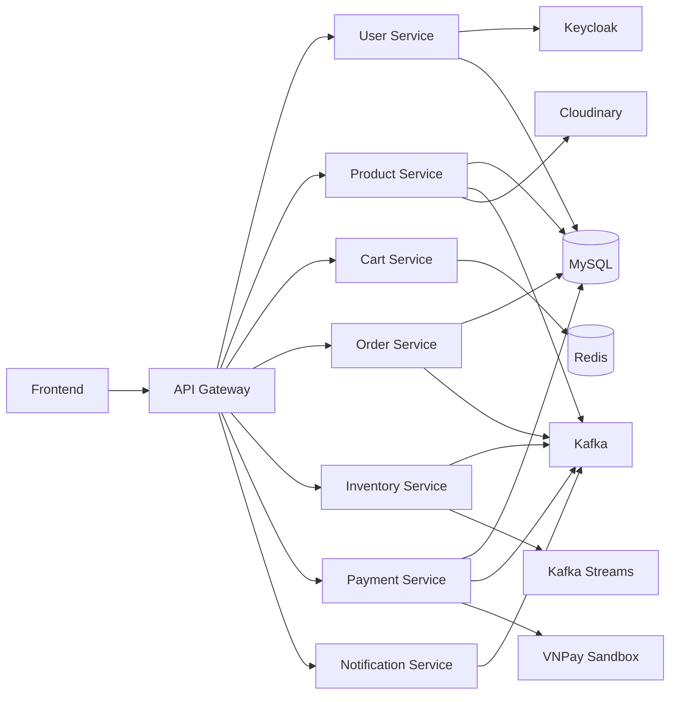
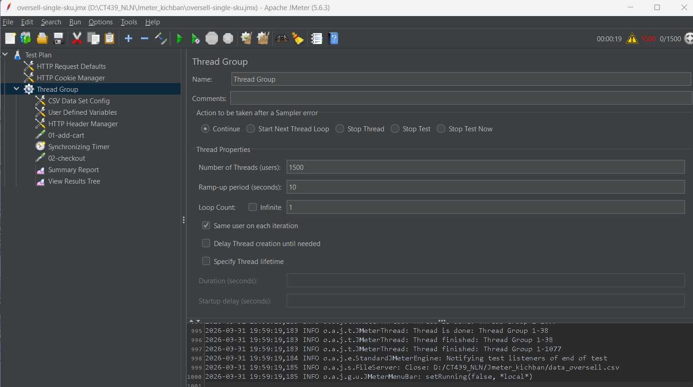
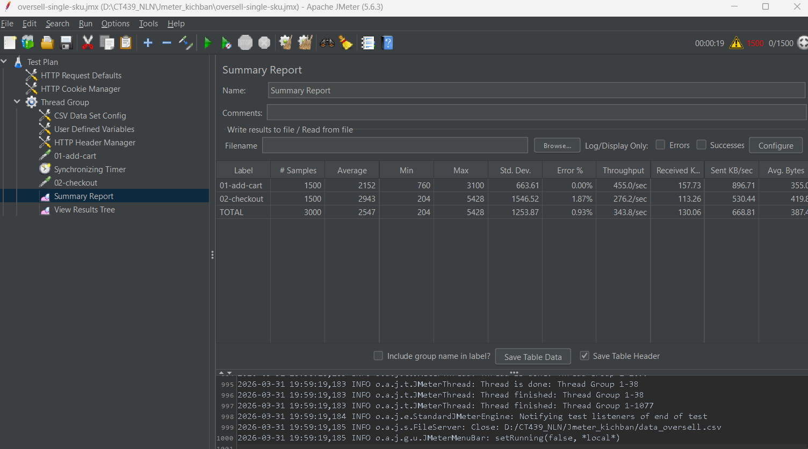
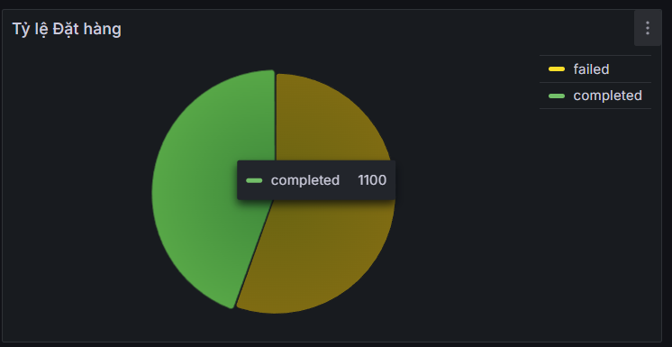
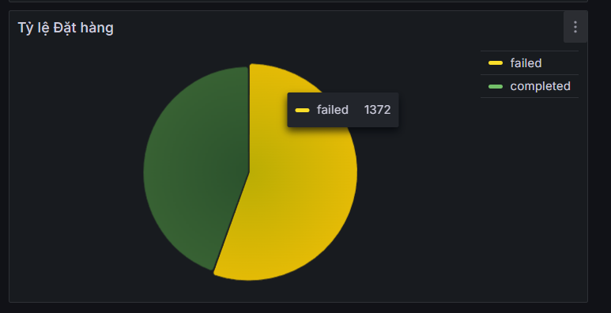
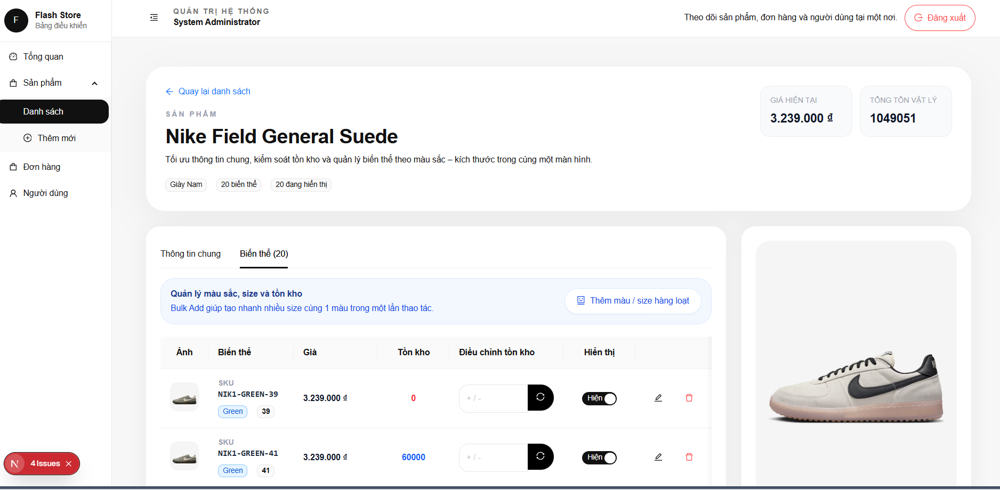
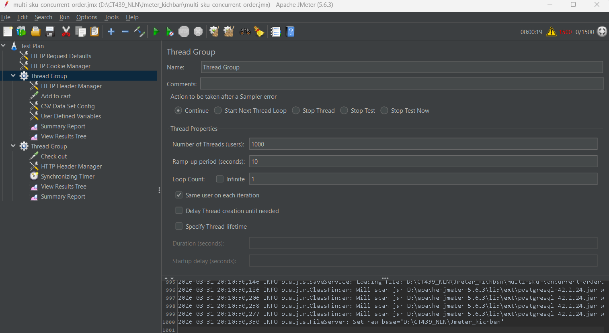
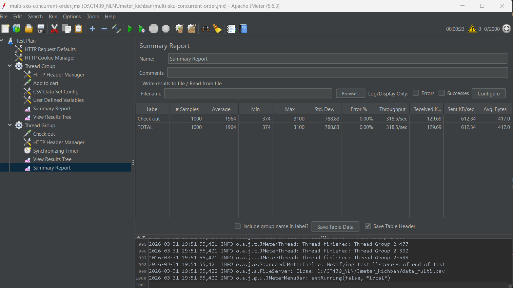
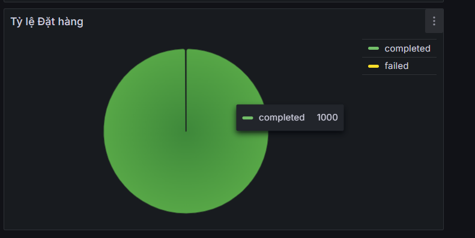

# Project 1 — Ecommerce Microservices Backend

Backend cho hệ thống **Ecommerce Microservices** xây dựng bằng Java/Spring Boot, tập trung vào:

- xử lý checkout đồng thời và chống overselling;
- đảm bảo tính nhất quán giữa Order, Inventory và Payment;
- giao tiếp bất đồng bộ qua Kafka/Kafka Streams;
- xác thực/phân quyền bằng Keycloak;
- khả năng retry, idempotency, recovery và backup/restore;
- tích hợp VNPay Sandbox và Cloudinary;
- cấu hình theo hướng production.

> **Trạng thái hiện tại:** source/configuration đã được harden theo hướng production và đã qua full-stack validation trên môi trường disposable. Project chưa được deploy public production.

- **Backend:** [ecommerce-backend-1-](https://github.com/truongnguyen3006/ecommerce-backend-1-)
- **Frontend:** [ecommerce-frontend-1-](https://github.com/truongnguyen3006/ecommerce-frontend-1-)

---

## Điểm nổi bật

- Microservices với **API Gateway + Eureka**.
- **MySQL + Flyway** cho dữ liệu nghiệp vụ và migration.
- **Redis** cho cart/state.
- **Kafka + Kafka Streams** cho flow bất đồng bộ và inventory.
- **Transactional Outbox** cho Order, Product và Payment.
- Idempotency cho checkout, callback payment và điều chỉnh kho.
- Chống stale update bằng revision khi sửa Product.
- Permanent SKU identity để tránh tái sử dụng SKU cũ sai ngữ cảnh.
- Cart cleanup có kiểm tra quantity/revision để tránh xóa nhầm dữ liệu mới.
- Keycloak + JWT cho USER/ADMIN và ownership.
- VNPay Return/IPN tách riêng vai trò.
- Cloudinary upload ảnh sản phẩm.
- Prometheus, Grafana và Zipkin cho observability.
- Docker Compose, CI, backup/restore và production profiles.

---

## Kiến trúc


```mermaid
flowchart LR
    CLIENT[Frontend] --> GW[API Gateway]

    GW --> USER[User Service]
    GW --> PRODUCT[Product Service]
    GW --> CART[Cart Service]
    GW --> ORDER[Order Service]
    GW --> INVENTORY[Inventory Service]
    GW --> PAYMENT[Payment Service]
    GW --> NOTI[Notification Service]

    USER --> KEYCLOAK[Keycloak]
    CART --> REDIS[(Redis)]

    PRODUCT --> MYSQL[(MySQL)]
    USER --> MYSQL
    ORDER --> MYSQL
    PAYMENT --> MYSQL

    PRODUCT --> KAFKA[Kafka]
    ORDER --> KAFKA
    PAYMENT --> KAFKA
    INVENTORY --> KAFKA
    NOTI --> KAFKA

    INVENTORY --> STREAMS[Kafka Streams]
    PRODUCT --> CLOUDINARY[Cloudinary]
    PAYMENT --> VNPAY[VNPay Sandbox]
```

### Các service

| Service | Chức năng | Port |
|---|---|---:|
| `api-gateway` | Gateway, routing, security | 8080 |
| `discovery-server` | Eureka Service Discovery | 8761 |
| `inventory-service` | Quản lý tồn kho, Kafka Streams | 8082 |
| `product-service` | Product, variant, SKU, Cloudinary | 8083 |
| `cart-service` | Giỏ hàng trên Redis | 8084 |
| `order-service` | Order orchestration, saga, outbox | 8086 |
| `notification-service` | Notification / STOMP | 8087 |
| `user-service` | User, address, Keycloak | 8088 |
| `payment-service` | VNPay, payment state, IPN/Return | 8089 |

Shared modules:

- `common-dto`
- `common-events`

---

## Công nghệ sử dụng

| Nhóm | Công nghệ |
|---|---|
| Ngôn ngữ | Java 24 |
| Backend | Spring Boot 3.5.7 |
| Microservices | Spring Cloud 2025.0.0 |
| Gateway | Spring Cloud Gateway |
| Discovery | Eureka |
| Authentication | Keycloak / OAuth2 / JWT |
| Database | MySQL |
| Migration | Flyway |
| Cache / Cart | Redis |
| Messaging | Apache Kafka |
| Stream Processing | Kafka Streams |
| Schema Registry | JSON Schema |
| Realtime | WebSocket / STOMP |
| Payment | VNPay Sandbox |
| Image Storage | Cloudinary |
| Monitoring | Prometheus / Grafana / Zipkin |
| Container | Docker / Docker Compose |
| Load Test | Apache JMeter |
| Build | Maven |

---

## Trạng thái kiểm thử hiện tại

| Hạng mục | Kết quả |
|---|---|
| Backend | **150 tests / 12 modules / 0 failures / 0 errors / 0 skipped** |
| Keycloak lifecycle | **5 tests PASS** với Keycloak 26.8.0 |
| Frontend liên kết | **79 tests PASS** |
| MySQL migration/runtime | MySQL 8.4.10 PASS |
| Production images | **12 images build PASS** |
| Disposable production stack | **20 services healthy** |
| Smoke test | PASS |
| Restart / replay / backup / restore | **13 / 13 checks PASS** |
| VNPay Sandbox local | **End-to-end VERIFIED** |
| Public production deployment | Chưa thực hiện |

Các kết quả trên đã được xác minh qua CI và full-stack validation trên nhánh hiện tại.

---

## Chạy local

### Yêu cầu

- JDK 24
- Maven 3.9+
- Docker Desktop + Docker Compose
- Node.js/npm nếu chạy frontend
- JMeter nếu muốn chạy lại load test

### Clone

Hiện tại:

```bash
git clone --branch production-ready-final https://github.com/truongnguyen3006/ecommerce-backend-1-.git
cd ecommerce-backend-1-
```

### Build

Chạy project local:

```bash
mvn clean install -DskipTests
```

Chạy đầy đủ test:

```bash
mvn clean verify
```

### Lưu ý khi chạy test trên Windows

`RedisCartAtomicTests` tự khởi chạy một Redis process riêng và mặc định tìm:

```text
/usr/bin/redis-server
```

Do đó trên Windows có thể gặp lỗi:

```text
Cannot run program "/usr/bin/redis-server"
```

Có thể chạy test này bằng WSL/Linux hoặc cấu hình:

```powershell
$env:TEST_REDIS_EXECUTABLE="C:\path\to\redis-server.exe"
mvn clean verify
```

### Khởi động hạ tầng

```bash
docker compose up -d mysql-business redis keycloak-mysql keycloak kafka schema-registry
docker compose ps
```

Không chạy `docker compose down -v` nếu không muốn xóa volume/data local.

### Thứ tự chạy service gợi ý

1. `discovery-server`
2. `inventory-service`
3. `order-service`
4. `payment-service`
5. `cart-service`
6. `notification-service`
7. `user-service`
8. `product-service`
9. `api-gateway`

Ví dụ:

```bash
mvn -pl order-service spring-boot:run
```

Các biến môi trường local tham khảo nằm trong `.env.example`.

---

## Cấu hình VNPay Sandbox

Payment Service dùng các biến môi trường:

```text
VNPAY_TMN_CODE
VNPAY_SECRET_KEY
VNPAY_PAY_URL
VNPAY_RETURN_URL
VNPAY_IPN_URL
FRONTEND_BASE_URL
ORDER_SERVICE_BASE_URL
```

Flow đã được test local thành công:

```text
Checkout
→ VNPay Sandbox
→ NCB test card
→ OTP
→ IPN / Return
→ Payment SUCCESS
→ Order COMPLETED
```

Lưu ý:

- không commit `VNPAY_SECRET_KEY`;
- Return URL chỉ dùng cho browser redirect;
- IPN là callback server-to-server để backend xử lý trạng thái payment;
- kết quả trên là **VNPay Sandbox**, không phải thanh toán production.

---

## Cấu hình Cloudinary

Product Service dùng:

```text
CLOUDINARY_CLOUD_NAME
CLOUDINARY_API_KEY
CLOUDINARY_API_SECRET
CLOUDINARY_PRODUCT_FOLDER
```

Credential chỉ nằm ở backend, không đưa secret vào frontend hoặc repository.

---

# Kết quả Load Test

Các kết quả bên dưới là **benchmark local lịch sử**, được giữ lại để thể hiện mục tiêu ban đầu của project: kiểm thử concurrent checkout và chống overselling.

> Các số liệu này không đại diện cho năng lực production/cloud.

## Kịch bản 1 — Single-SKU Oversell

SKU: `NIK1-GREEN-39`  
Tồn kho ban đầu: **100**  
Tải kiểm thử: **1.500 virtual users**

### JMeter Test Plan



### JMeter Summary



Kết quả:

| Chỉ số | Kết quả |
|---|---:|
| add-cart samples | 1.500 |
| add-cart error | 0% |
| add-cart throughput | ~455 req/s |
| checkout samples | 1.500 |
| checkout error | ~1,87% |
| checkout throughput | ~276,2 req/s |
| tổng throughput | ~343,8 req/s |
| đơn hoàn tất | **100** |
| tồn kho cuối | **0** |
| tồn kho âm | **Không ghi nhận trong kết quả lưu** |

### Grafana — Completed



Ảnh hiển thị `completed = 1100` vì metric được cộng dồn qua hai lần benchmark:

```text
100 đơn single-SKU
+
1.000 đơn multi-SKU
=
1.100 completed tích lũy
```

### Grafana — Failed



Kết quả lưu ghi nhận **1.372 order failed/rejected** sau khi stock hết.

### Inventory sau benchmark



Tồn kho cuối của `NIK1-GREEN-39` bằng **0**.

---

## Kịch bản 2 — Multi-SKU Concurrent Checkout

### JMeter Test Plan



### JMeter Summary



Kết quả:

| Chỉ số | Kết quả |
|---|---:|
| checkout samples | **1.000** |
| JMeter error | **0%** |
| response time trung bình | ~1.964 ms |
| throughput | ~318,5 req/s |

### Grafana



Test plan nằm trong thư mục [Jmeter Script](./Jmeter%20Script/).

---

## Production-oriented

Project hiện đã có:

- production profile riêng;
- externalized secrets;
- Flyway + Hibernate `validate`;
- Redis persistence;
- Kafka/Streams persistence;
- Keycloak production config;
- health/readiness/liveness;
- Docker production images;
- CI workflow;
- backup/restore scripts;
- recovery documentation;
- Prometheus/Grafana/Zipkin.

Project **chưa claim production-ready hoàn toàn** vì chưa có public deployment, domain/TLS production, production VNPay merchant, multi-instance HA và full container vulnerability scan.

---

## Tài liệu liên quan

- [DEPLOYMENT.md](DEPLOYMENT.md)
- [PRODUCTION_CHECKLIST.md](PRODUCTION_CHECKLIST.md)
- [BACKUP_RESTORE.md](BACKUP_RESTORE.md)
- [docs/production-recovery.md](docs/production-recovery.md)

---

## Tác giả

**Nguyễn Lâm Trường**

- GitHub: [truongnguyen3006](https://github.com/truongnguyen3006)
- Frontend: [ecommerce-frontend-1-](https://github.com/truongnguyen3006/ecommerce-frontend-1-)
