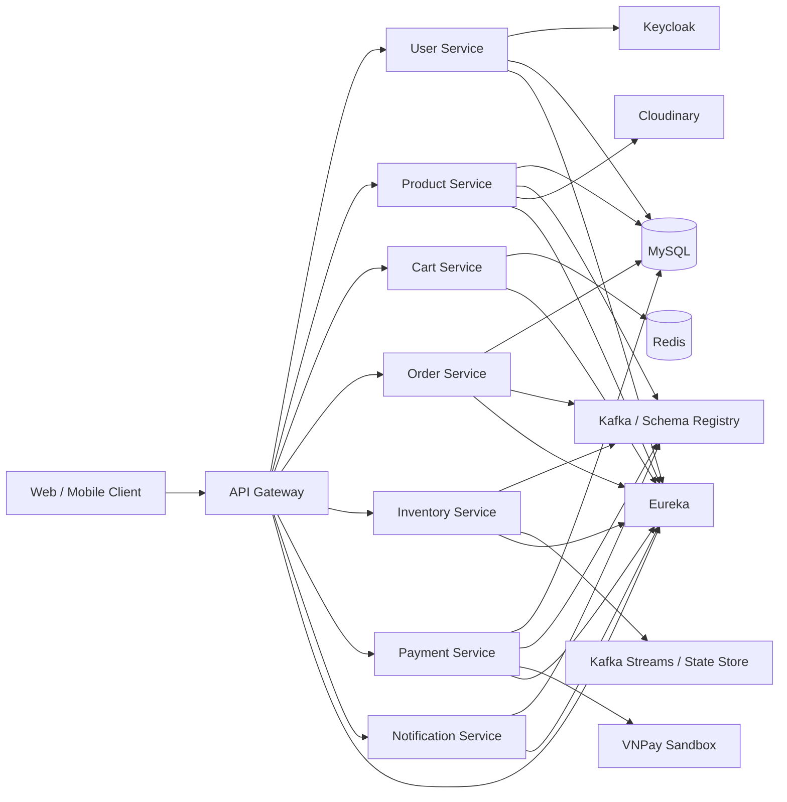

# Project 1 — High-Concurrency Ecommerce Microservices Backend

Backend cho hệ thống **Ecommerce Microservices** tập trung vào ba bài toán chính:

1. **concurrent checkout và overselling prevention**;
2. **order / inventory / payment consistency** trong luồng bất đồng bộ;
3. **recoverability và production-oriented hardening** khi service, broker, Redis hoặc external provider gặp lỗi.

Project được xây dựng bằng Java/Spring Boot và kết hợp MySQL, Redis, Kafka/Kafka Streams, Keycloak, Eureka, API Gateway, WebSocket/STOMP, Prometheus/Grafana/Zipkin, VNPay Sandbox và Cloudinary.

> **Trạng thái hiện tại:** source/configuration đã được harden theo hướng production và đã qua disposable full-stack validation. Project **chưa được tuyên bố là một public production deployment**; domain/TLS thật, owner environment, multi-instance capacity và production payment provider vẫn là các bước riêng.

- **Backend:** [truongnguyen3006/ecommerce-backend-1-](https://github.com/truongnguyen3006/ecommerce-backend-1-)
- **Frontend:** [truongnguyen3006/ecommerce-frontend-1-](https://github.com/truongnguyen3006/ecommerce-frontend-1-)
- **Current release candidate branch:** `production-ready-final`
- **Final detailed validation:** [PROJECT1_BATCH4_5_6_FINAL_REPORT.md](PROJECT1_BATCH4_5_6_FINAL_REPORT.md)

---

## Current Validation Status

| Validation | Current result |
|---|---|
| Java build | Java 24 / Maven reactor PASS |
| Backend default suite | **150 tests / 12 modules / 0 failures / 0 errors / 0 skipped** |
| Native Keycloak lifecycle suite | **5 tests PASS** against Keycloak 26.8.0 |
| Frontend paired release | **79 tests PASS** |
| MySQL migration/runtime probes | MySQL 8.4.10 PASS |
| Production images | **12 images built successfully** |
| Disposable production stack | **20 services healthy** |
| Full-stack smoke | PASS |
| Business / restart / replay / backup / restore rehearsal | **13 / 13 checks PASS** |
| VNPay Sandbox | **Manual local end-to-end flow VERIFIED on 2026-10-04** |
| Public deployment | NOT DONE |
| Production VNPay merchant/settlement | NOT VERIFIED |
| Multi-instance / measured capacity | NOT VERIFIED |
| Container/OS SCA | NOT VERIFIED |

Batch 6 vẫn được phân loại là **PARTIAL** trong final report vì còn dependency/reachability triage, container/OS SCA, real DLT/operator rehearsal, owner legacy-data/realm adoption và scale/capacity validation. Điều này không làm thay đổi các source/runtime gates đã PASS.

---

## Architecture


```mermaid
flowchart LR
    CLIENT[Web / Mobile Client] --> GW[API Gateway]
    GW --> USER[User Service]
    GW --> PRODUCT[Product Service]
    GW --> CART[Cart Service]
    GW --> ORDER[Order Service]
    GW --> INVENTORY[Inventory Service]
    GW --> PAYMENT[Payment Service]
    GW --> NOTI[Notification Service]

    USER --> KC[Keycloak]
    PRODUCT --> MYSQL[(MySQL)]
    USER --> MYSQL
    ORDER --> MYSQL
    PAYMENT --> MYSQL

    CART --> REDIS[(Redis)]

    PRODUCT --> KAFKA[Kafka / Schema Registry]
    ORDER --> KAFKA
    PAYMENT --> KAFKA
    INVENTORY --> KAFKA
    NOTI --> KAFKA

    INVENTORY --> STREAMS[Kafka Streams / State Store]

    PRODUCT --> CLOUDINARY[Cloudinary]
    PAYMENT --> VNPAY[VNPay Sandbox]

    GW --> EUREKA[Eureka]
    USER --> EUREKA
    PRODUCT --> EUREKA
    CART --> EUREKA
    ORDER --> EUREKA
    INVENTORY --> EUREKA
    PAYMENT --> EUREKA
    NOTI --> EUREKA
```

### Application services

| Module | Responsibility | Default port |
|---|---|---:|
| `api-gateway` | Public API entry, routing, security boundary | 8080 |
| `discovery-server` | Eureka service discovery | 8761 |
| `product-service` | Catalog, variants, SKU identity, Cloudinary | 8083 |
| `inventory-service` | Stock, Kafka Streams, idempotent stock operations | 8082 |
| `cart-service` | Redis-backed owner cart and atomic cleanup | 8084 |
| `order-service` | Order orchestration, saga state, transactional outbox | 8086 |
| `payment-service` | VNPay lifecycle, Return/IPN, payment reconciliation | 8089 |
| `user-service` | User profile, address invariants, Keycloak provisioning | 8088 |
| `notification-service` | Authenticated order-status notifications | 8087 |

Shared modules:

- `common-dto`
- `common-events`

---

## Core Engineering Highlights

### Concurrent inventory consistency

- Inventory events are keyed by `skuCode`.
- Kafka Streams uses persistent state stores.
- Inventory topology uses `exactly_once_v2` for its Kafka-side processing.
- Stable event / operation identity protects duplicate retries.
- Stock adjustment cannot silently apply twice.
- Negative-stock and duplicate-restoration scenarios are regression tested.

### Transactional outbox

Order, Payment and Product write business state and outbound event intent durably before publication. Outbox publication is retryable and consumers are designed for at-least-once delivery with idempotent handling.

This avoids treating a successful database commit plus failed Kafka send as if the entire distributed operation had succeeded.

### Order / payment / inventory safety

The hardened flow protects against states equivalent to:

```text
payment SUCCESS
+
order CANCELLED
+
inventory RESTORED
```

Payment fencing, durable inventory outcome evidence and explicit reconciliation are preferred over unsafe automatic compensation when the system cannot prove the financial state.

### Aged saga and DLT handling

- durable inventory outcome receipts;
- bounded aged-workflow retries;
- explicit investigation/reconciliation state;
- SQL workflow dead-letter evidence;
- no blind stock restoration;
- no automatic refund claim.

### Permanent SKU identity

Deleted/retired SKU codes remain reserved so a new product cannot accidentally inherit historical inventory or event identity from an old variant.

### Product concurrency

Product updates use a checked revision. A stale admin editor receives a conflict instead of silently overwriting a newer catalog/variant update.

### Atomic cart cleanup

Purchased-cart cleanup is owner scoped and conditional on SKU, quantity and line revision. A concurrent/newer cart mutation is retained instead of being deleted by an old checkout snapshot.

### Recoverable identity provisioning

Registration coordinates SQL and Keycloak using a durable provisioning intent and stable idempotency identity. Partial provider/SQL failures can be retried without adopting an unrelated Keycloak user or storing passwords for background replay.

---

## VNPay Sandbox

The payment flow separates two responsibilities:

- **Return URL:** browser navigation only; it does not prove payment success.
- **IPN:** server-to-server provider notification used for authoritative callback processing.

Additional hardening includes:

- signed callback verification;
- amount / merchant / transaction validation;
- idempotent duplicate IPN handling;
- 15-minute payment-attempt expiry metadata;
- no indefinite reuse of an expired payment URL;
- explicit reconciliation for ambiguous/late payment evidence;
- cancellation/payment race protection.

### Manual local sandbox verification

On **2026-10-04**, a new VNPay test merchant was used to complete a local end-to-end sandbox transaction:

```text
Flash Store checkout
    -> VNPay Sandbox
    -> NCB test card
    -> OTP
    -> signed callback / return flow
    -> Payment SUCCESS
    -> Order COMPLETED
```

This verifies the **VNPay Sandbox integration in the local environment**. It is **not** a claim of production VNPay merchant approval or real-money settlement.

Local payment configuration uses environment variables:

```text
VNPAY_TMN_CODE
VNPAY_SECRET_KEY
VNPAY_PAY_URL
VNPAY_RETURN_URL
VNPAY_IPN_URL
FRONTEND_BASE_URL
ORDER_SERVICE_BASE_URL
```

Never commit VNPay HashSecret or any provider credential.

---

## Cloudinary

Product image upload is handled by Product Service. Credentials remain backend-only:

```text
CLOUDINARY_CLOUD_NAME
CLOUDINARY_API_KEY
CLOUDINARY_API_SECRET
CLOUDINARY_PRODUCT_FOLDER
```

The frontend receives only the resulting image URLs/public identifiers.

---

## Production-Oriented Configuration

The repository contains a separate production configuration rather than reusing local development defaults.

Current production-oriented assets include:

- `application-prod.properties` profiles;
- externalized secrets;
- Flyway migrations + Hibernate `validate`;
- production seeders disabled by default;
- Redis AOF/RDB persistence policy;
- Kafka / Streams persistent volumes and fixed identities;
- optimized Keycloak production image/configuration;
- standalone frontend image;
- reverse-proxy / ingress configuration;
- health, readiness and liveness probes;
- Prometheus, Grafana and Zipkin configuration;
- backup / restore scripts;
- guarded deployment scripts;
- CI and release workflows;
- production checklist and recovery runbooks.

Key documents:

- [DEPLOYMENT.md](DEPLOYMENT.md)
- [PRODUCTION_CHECKLIST.md](PRODUCTION_CHECKLIST.md)
- [BACKUP_RESTORE.md](BACKUP_RESTORE.md)
- [docs/production-recovery.md](docs/production-recovery.md)
- [docs/batch4-correctness.md](docs/batch4-correctness.md)
- [docs/batch5-consistency.md](docs/batch5-consistency.md)
- [docs/batch6-validation.md](docs/batch6-validation.md)
- [docs/dependency-review-batch6.md](docs/dependency-review-batch6.md)

---

## Technology Stack

| Area | Technology |
|---|---|
| Language | Java 24 |
| Backend | Spring Boot 3.5.7 |
| Cloud stack | Spring Cloud 2025.0.0 |
| Gateway | Spring Cloud Gateway |
| Discovery | Eureka |
| Authentication | Keycloak / OAuth2 / JWT |
| Database | MySQL |
| Migration | Flyway |
| Cache / cart state | Redis |
| Messaging | Apache Kafka |
| Stream processing | Kafka Streams |
| Schema | Schema Registry / JSON Schema |
| Realtime | WebSocket / STOMP |
| Image storage | Cloudinary |
| Payment | VNPay Sandbox |
| Observability | Prometheus / Grafana / Zipkin |
| Containerization | Docker / Docker Compose |
| Reverse proxy | Nginx |
| Load testing | Apache JMeter |
| Build | Maven |

---

## Run Locally

### Requirements

- JDK **24**
- Maven **3.9+**
- Docker Desktop / Docker Compose
- Node.js/npm for the frontend
- JMeter only if you want to repeat the historical load tests

### Clone

After the final branch is promoted to `main`:

```bash
git clone https://github.com/truongnguyen3006/ecommerce-backend-1-.git
cd ecommerce-backend-1-
```

Until then, use:

```bash
git clone --branch production-ready-final https://github.com/truongnguyen3006/ecommerce-backend-1-.git
cd ecommerce-backend-1-
```

### Build

For a normal local startup:

```bash
mvn clean install -DskipTests
```

For the complete source gate:

```bash
mvn clean verify
```

### Windows note for Redis atomic tests

`RedisCartAtomicTests` intentionally launches an isolated Redis process and does **not** attach to the owner's running Redis container.

Its default executable is Linux:

```text
/usr/bin/redis-server
```

Therefore a direct Windows `mvn clean verify` needs either:

- WSL/Linux with `redis-server` installed; or
- `TEST_REDIS_EXECUTABLE` pointing to a compatible local Redis executable.

Example PowerShell:

```powershell
$env:TEST_REDIS_EXECUTABLE="C:\path\to\redis-server.exe"
mvn clean verify
```

A failure such as `Cannot run program "/usr/bin/redis-server"` on Windows is an environment/test-harness issue, not evidence that the Cart business assertions failed.

### Start infrastructure

From the repository root:

```bash
docker compose up -d mysql-business redis keycloak-mysql keycloak kafka schema-registry
docker compose ps
```

Do not run `docker compose down -v` unless you intentionally want to remove local volumes/data.

### Start application services

Recommended local order:

1. `discovery-server`
2. `inventory-service`
3. `order-service`
4. `payment-service`
5. `cart-service`
6. `notification-service`
7. `user-service`
8. `product-service`
9. `api-gateway`

Example:

```bash
mvn -pl order-service spring-boot:run
```

See [docs/local-startup-audit.md](docs/local-startup-audit.md) for local ports, Keycloak startup checks and common startup failures.

---

## Database Migrations

Recent hardening added additive migrations for:

- durable saga / DLT recovery;
- permanent SKU identity;
- payment-attempt expiry;
- checked product revision;
- one-default-address invariant;
- recoverable Keycloak/SQL provisioning.

Existing inherited migrations were not rewritten. Production configuration keeps Flyway validation and Hibernate `validate`.

Fresh MySQL 8.4.10 startup and the new migration paths were exercised in CI. Adoption of an owner's older/legacy database still requires a backed-up rehearsal rather than destructive reset.

---

## Automated Validation

### Backend

Final default reactor:

```text
150 tests
12 modules
0 failures
0 errors
0 skipped
```

Separate actual Keycloak 26.8.0 lifecycle suite:

```text
5 tests
0 failures
0 errors
0 skipped
```

### Full-stack disposable runtime

The final CI rehearsal built **12 production images**, started a **20-service production Compose stack**, passed smoke checks and completed **13/13** named scenarios.

Covered scenarios include:

- idempotent user provisioning retry;
- USER / ADMIN / owner authorization boundaries;
- one-default-address invariant;
- MySQL migration / SKU / revision checks;
- COD cart cleanup;
- read-only VNPay Return + signed IPN;
- cancellation and partial inventory compensation;
- idempotent admin stock adjustment;
- Kafka outage + Order restart + outbox recovery;
- Payment restart + callback retry;
- Inventory SIGKILL + Streams recovery;
- Redis AOF restart;
- duplicate stable event replay;
- coordinated SQL / Redis / Kafka / Streams backup and isolated restore.

For the exact evidence and CI runs, see [PROJECT1_BATCH4_5_6_FINAL_REPORT.md](PROJECT1_BATCH4_5_6_FINAL_REPORT.md).

---

# Historical Load-Test Evidence

The load-test results below are intentionally retained because they document the original concurrency/overselling objective of the project.

> These are **historical local benchmark results**, not production-capacity claims. They were captured before the later production-hardening batches and should not be interpreted as public-cloud SLO/SLA numbers.

## Scenario 1 — Single-SKU Oversell

Test SKU: `NIK1-GREEN-39`  
Initial stock: **100**  
Recorded benchmark: **1,500 virtual users**

### JMeter test plan


### JMeter summary


Recorded result:

| Metric | Result |
|---|---:|
| add-cart | 1,500 samples |
| add-cart JMeter error | 0% |
| add-cart throughput | ~455.0 req/s |
| checkout | 1,500 samples |
| checkout JMeter error | ~1.87% |
| checkout throughput | ~276.2 req/s |
| total samples | 3,000 |
| total throughput | ~343.8 req/s |
| completed orders for the contested SKU | **100** |
| final stock | **0** |
| observed negative stock | **none in the saved result** |

### Grafana — cumulative completed metric


The screenshot shows `completed = 1100` because the Grafana metric was cumulative across two saved benchmark runs:

```text
100 completed single-SKU orders
+
1000 completed multi-SKU orders
=
1100 cumulative completed
```

It must **not** be read as 1,100 successful orders from the single-SKU test.

### Grafana — failed business outcomes


The stored dashboard shows **1,372 failed/rejected business orders** after stock exhaustion. JMeter also recorded roughly 28 request-level errors (~1.87%). Together with the 100 completed orders, these values account for the 1,500 checkout samples in the saved run.

### Inventory after the test


Final stock for `NIK1-GREEN-39` is **0**.

---

## Scenario 2 — Multi-SKU Concurrent Checkout

This scenario distributes requests across multiple SKUs rather than concentrating all contention on one SKU.

### JMeter test plan


### JMeter summary


Saved benchmark result:

| Metric | Result |
|---|---:|
| checkout samples | **1,000** |
| JMeter error | **0%** |
| average response time | ~1,964 ms |
| throughput | ~318.5 req/s |

### Grafana


### Re-running JMeter

Test plans are stored in [Jmeter Script](./Jmeter%20Script/):

- `oversell-single-sku.jmx`
- `multi-sku-concurrent-order.jmx`

Related CSV data:

- `data_oversell.csv`
- `data_multi.csv`

When changing virtual-user count, update both the Thread Group and `Synchronizing Timer`. Also refresh the access token, CSV path and target host/port before running.

---

## Security Notes

- Never commit real VNPay, Cloudinary, Keycloak or database secrets.
- Production secrets are expected through environment/secret management.
- Seed/demo credentials are local-only and should not be reused publicly.
- Production management/data networks are intended to remain private.
- Do not expose Actuator/management endpoints through the public edge.
- A dependency metadata review exists in [docs/dependency-review-batch6.md](docs/dependency-review-batch6.md). Metadata matches are not automatically proven exploitability.
- Container/OS vulnerability scanning and complete backend advisory reachability/patch triage remain explicit pre-public-release work.
- Any secret that has previously been exposed should be rotated before public deployment.

---

## Known Boundaries

The current project intentionally does **not** claim:

- public production deployment;
- real-money VNPay settlement;
- production VNPay merchant approval;
- multi-node Kafka/MySQL HA;
- safe arbitrary multi-replica Inventory/Notification scale-out;
- measured cloud capacity/SLA;
- full container/OS vulnerability clearance;
- automated financial refund accounting for ambiguous payments.

It **does** demonstrate a production-oriented microservice codebase with tested correctness, idempotency, recovery, observability, migrations, backup/restore and failure handling.

---

## Documentation

| Document | Purpose |
|---|---|
| [PROJECT1_BATCH4_5_6_FINAL_REPORT.md](PROJECT1_BATCH4_5_6_FINAL_REPORT.md) | Final hardening and validation evidence |
| [DEPLOYMENT.md](DEPLOYMENT.md) | Production deployment/runbook |
| [PRODUCTION_CHECKLIST.md](PRODUCTION_CHECKLIST.md) | Release checklist |
| [BACKUP_RESTORE.md](BACKUP_RESTORE.md) | Backup/restore procedure |
| [docs/batch4-correctness.md](docs/batch4-correctness.md) | Core correctness hardening |
| [docs/batch5-consistency.md](docs/batch5-consistency.md) | API/data/client consistency |
| [docs/batch6-validation.md](docs/batch6-validation.md) | Resilience/recovery validation |
| [docs/dependency-review-batch6.md](docs/dependency-review-batch6.md) | Dependency advisory metadata review |
| [docs/local-startup-audit.md](docs/local-startup-audit.md) | Local startup guide |

---

## Author

**Nguyễn Lâm Trường**

- GitHub: [truongnguyen3006](https://github.com/truongnguyen3006)
- Frontend: [ecommerce-frontend-1-](https://github.com/truongnguyen3006/ecommerce-frontend-1-)
